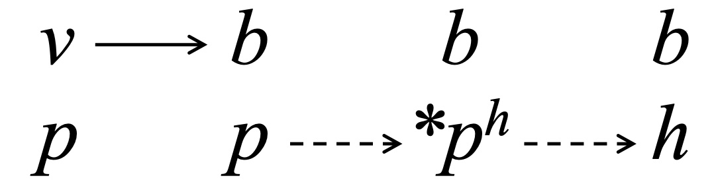

# **Phonetic and Phonological Analysis**
### *Sound Change*
### Fall 2025
\
Wednesdays, 11:30am\
Ross Building, Rm. S803\
Instructor: [Chandan Narayan](https://ch-narayan.github.io)\
Contact: [chandann@yorku.ca](mailto:chandann@yorku.ca)\
[Outline](docs/Outline.html)

### About

This graduate seminar will be a rigourous introduction to the topic of sound change. We will survey the intellectual history of formal approaches in the sound change literature. The course presupposes your having some background exposure to basic principles in phonetics (articulatory and acoustic) and phonology (nothing overly theoretical). We will focus on acoustics and speech perception explanations in sound change, but also consider sociological and extra-linguistic forces affecting change. Students will be required to present readings and lead discussion. Final projects will address some problem in sound change of interest to the student. 

### How to use this site

This site will have links to all of the required readings and on occasion some lecture notes. 

</a>

